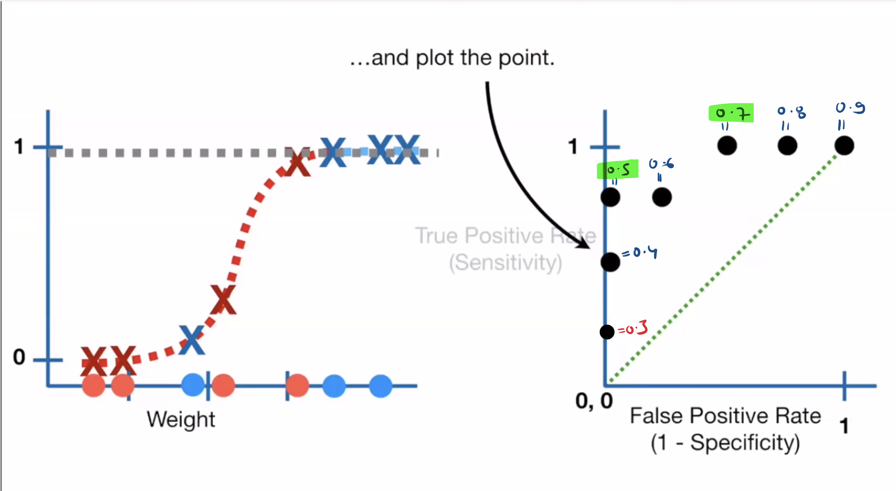

# 🧠 Logistic Regression – Complete Guide with Code

---

## 📖 1. Definition

**Logistic Regression** is a statistical method used for **binary classification** — that is, it helps predict one of two possible outcomes (e.g., yes/no, 1/0, true/false) based on input features.

---

- Classification into two categories:
  - **Category A (e.g., Default = 1 / Churn = 1)**
  - **Category B (e.g., Not Default = 0 / Not Churn = 0)**
- We calculate:
  ```
  P(Default) = P(A)
  P(Not Default) = 1 - P(A)
  ```
- Decision Rule:
  - If `P(A) > 50%` → Category A → Customer is likely to default
  - If `P(A) < 50%` → Category B → Customer is NOT likely to default

---

## 💡 2.Key Idea

Although it’s called "regression", it’s used for **classification**, not regression. Logistic Regression uses the **logistic (sigmoid) function** to map predicted values to probabilities between 0 and 1.

---

## 3.The Logistic Regression Model

In logistic regression, we model the probability that a binary target variable \( y \) is 1 given the input features \( X \). The model is:

\[
P(y=1 \mid X) = \frac{1}{1 + e^{-z}} = \frac{1}{1 + e^{-(\beta_0 + \beta_1 X_1 + \beta_2 X_2 + \cdots + \beta_n X_n)}}
\]

Here:
- \( \beta_0 \) is the intercept (bias term),
- \( \beta_1, \beta_2, \dots, \beta_n \) are the model coefficients,
- \( X_1, X_2, \dots, X_n \) are the input features.

The function used is the **sigmoid function**, which maps any real-valued number into the range (0, 1).

---

### Log-Odds Interpretation

Logistic regression models the **log-odds** (also called the **logit**) of the outcome as a linear function of the inputs:

\[
\log\left(\frac{P(y=1 \mid X)}{1 - P(y=1 \mid X)}\right) = \beta_0 + \beta_1 X_1 + \beta_2 X_2 + \cdots + \beta_n X_n
\]

Each coefficient \( \beta_i \) represents the change in the log-odds of \( y = 1 \) for a one-unit increase in \( X_i \), holding all other features constant.

---

### Training the Model: Loss Function

We use **maximum likelihood estimation** to find the parameters \( \beta \) that best fit the data. This is done by minimizing the **log loss** (also called **binary cross-entropy**):

\[
\text{Loss} = -\frac{1}{m} \sum_{i=1}^{m} \left[ y^{(i)} \log(\hat{y}^{(i)}) + (1 - y^{(i)}) \log(1 - \hat{y}^{(i)}) \right]
\]

Where:
- \( m \) is the number of training samples,
- \( \hat{y}^{(i)} = P(y=1 \mid X^{(i)}) \) is the predicted probability for sample \( i \),
- \( y^{(i)} \) is the true label (0 or 1).

This loss is minimized using optimization algorithms like **gradient descent**.

---

### Decision Boundary

A decision boundary separates the input space into two regions: one where the model predicts \( y=1 \), and another where it predicts \( y=0 \).

The boundary is where \( P(y=1 \mid X) = 0.5 \), or equivalently:

\[
\beta_0 + \beta_1 X_1 + \beta_2 X_2 + \cdots + \beta_n X_n = 0
\]

This is a linear boundary (a hyperplane) in the feature space.

---

### Summary

- Logistic regression models the probability of a binary outcome using the sigmoid function.
- Coefficients represent changes in the log-odds of the outcome.
- Model is trained by minimizing log loss (cross-entropy).
- The decision boundary is linear in feature space.


---

### ✅ When to Use

- When the **target variable is binary** (e.g., spam or not spam)
- When the **relationship between features and log-odds is linear**
- When you want **interpretable coefficients** (e.g., odds ratios)
- When you need **fast, efficient, and simple classification**

---

### 🤔 Why Use Logistic Regression

- Simple and easy to implement
- Efficient on small datasets
- Probabilistic output (confidence of prediction)
- Easy to interpret results

---

## 🔢 4.Logistic Regression in Python (Using Scikit-Learn)

This example demonstrates how to perform binary classification using Logistic Regression with the `sklearn` library.

---

### 📦 Import Libraries

```python
import pandas as pd
from sklearn.model_selection import train_test_split
from sklearn.linear_model import LogisticRegression
from sklearn.metrics import accuracy_score, confusion_matrix, classification_report
```
---

### 🧪 Sample Dataset (Titanic Survival)

```python
# Load dataset from seaborn for demo purposes
import seaborn as sns
data = sns.load_dataset("titanic")

# Use a subset of features for simplicity
df = data[['survived', 'pclass', 'sex', 'age']].dropna()

# Convert categorical 'sex' to numeric
df['sex'] = df['sex'].map({'male': 0, 'female': 1})
```
---

### ✂️ Split Data

```python
X = df[['pclass', 'sex', 'age']]
y = df['survived']

X_train, X_test, y_train, y_test = train_test_split(X, y, test_size=0.2, random_state=42)
```
---

### ⚙️ Train the Model

```python
model = LogisticRegression()
model.fit(X_train, y_train)
```
---

### 📊 Evaluate the Model

```python
y_pred = model.predict(X_test)

print("Accuracy:", accuracy_score(y_test, y_pred))
print("Confusion Matrix:\n", confusion_matrix(y_test, y_pred))
print("Classification Report:\n", classification_report(y_test, y_pred))
```
---

### 🔍 Predicting Probabilities

```python
# Predict survival probability for the test set
probabilities = model.predict_proba(X_test)
print("First 5 prediction probabilities:\n", probabilities[:5])
```
---

### 📈 Visualizing Sigmoid (Optional)

```python
import numpy as np
import matplotlib.pyplot as plt

def sigmoid(z):
    return 1 / (1 + np.exp(-z))

z = np.linspace(-10, 10, 100)
plt.plot(z, sigmoid(z))
plt.title("Sigmoid Function")
plt.xlabel("z")
plt.ylabel("Sigmoid(z)")
plt.grid(True)
plt.show()
```
---

## 🧪 5.Code Example (Using 4 Features)

```python
import numpy as np
import pandas as pd
from sklearn.linear_model import LogisticRegression
from sklearn.model_selection import train_test_split
from sklearn.metrics import classification_report

# Sample data with more than 2 features
data = {
    'age': [25, 45, 35, 33, 52, 23, 43, 36, 29, 41],
    'income': [50000, 100000, 75000, 72000, 120000, 40000, 95000, 61000, 58000, 97000],
    'credit_score': [650, 580, 720, 710, 540, 690, 600, 700, 680, 610],
    'loan_amount': [20000, 45000, 30000, 28000, 50000, 15000, 40000, 26000, 23000, 42000],
    'default': [0, 1, 0, 0, 1, 0, 1, 0, 0, 1]
}

df = pd.DataFrame(data)

# Features and target
X = df[['age', 'income', 'credit_score', 'loan_amount']]
y = df['default']

# Train-test split
X_train, X_test, y_train, y_test = train_test_split(X, y, test_size=0.3, random_state=42)

# Model
model = LogisticRegression()
model.fit(X_train, y_train)

# Prediction
y_pred = model.predict(X_test)

# Report
print(classification_report(y_test, y_pred))
```

---


## 6.Confusion Matrix Metrics in Logistic Regression (Category A vs Category B)

### 🎯 Scenario

In binary classification using **logistic regression**, suppose you're classifying whether an item belongs to:

- **Category A**: Positive class
- **Category B**: Negative class

---

### ✅ Confusion Matrix

|                        | **Predicted: Category A** | **Predicted: Category B** |
|------------------------|---------------------------|---------------------------|
| **Actual: Category A** | ✅ Model was correct       | ❌ Model missed it         |
| **Actual: Category B** | ❌ Model got it wrong      | ✅ Model was correct       |

---

### 🔍 Metrics in Simpler Way

#### For Category A

##### 1. **Precision (for Category A)**  
- **Meaning**: Out of all items that the model predicted as **Category A**, how many truly belonged to **Category A**?  
- **Formula**:
  ```
  Precision = (Correct predictions of Category A) / (All predictions of Category A)
  ```

##### 2. **Sensitivity / Recall (for Category A)**  
- **Meaning**: Out of all items that actually are **Category A**, how many did the model correctly identify?  
- **Formula**:
  ```
  Sensitivity (Recall) = (Correct predictions of Category A) / (All actual Category A items)
  ```

##### 3. **Specificity (for Category A)**  
- **Meaning**: Out of all items that are **not Category A**, how many did the model correctly recognize as **not Category A**?  
- **Formula**:
  ```
  Specificity = (Correct predictions of NOT Category A) / (All actual NOT Category A items)
  ```

##### 4. **Accuracy (Overall)**  
- **Meaning**: Out of **all items**, how many did the model classify correctly (regardless of category)?  
- **Formula**:
  ```
  Accuracy = (All correct predictions) / (Total number of items)
  ```

##### 5. **F1-Score (for Category A)**  
- **Meaning**: A balance between how many items the model **identified correctly** and how many it **missed or mislabeled**.  
- **Formula**:
  ```
  F1 = 2 * (Precision * Recall) / (Precision + Recall)
  ```

---

#### For Category B

##### 1. **Precision (for Category B)**  
- **Meaning**: Out of all items that the model predicted as **Category B**, how many truly belonged to **Category B**?  
- **Formula**:
  ```
  Precision = (Correct predictions of Category B) / (All predictions of Category B)
  ```

##### 2. **Sensitivity / Recall (for Category B)**  
- **Meaning**: Out of all items that actually are **Category B**, how many did the model correctly identify?  
- **Formula**:
  ```
  Sensitivity (Recall) = (Correct predictions of Category B) / (All actual Category B items)
  ```

##### 3. **Specificity (for Category B)**  
- **Meaning**: Out of all items that are **not Category B**, how many did the model correctly recognize as **not Category B**?  
- **Formula**:
  ```
  Specificity = (Correct predictions of NOT Category B) / (All actual NOT Category B items)
  ```

##### 4. **Accuracy (Overall)**  
- **Meaning**: Out of **all items**, how many did the model classify correctly (regardless of category)?  
- **Formula**:
  ```
  Accuracy = (All correct predictions) / (Total number of items)
  ```

##### 5. **F1-Score (for Category B)**  
- **Meaning**: A balance between how many items the model **identified correctly** and how many it **missed or mislabeled**.  
- **Formula**:
  ```
  F1 = 2 * (Precision * Recall) / (Precision + Recall)
  ```

---

### ✅ Confusion Matrix in terms of TP,FP, FN,TN

```
                Predicted
                 ↓
           ┌───────────────┬────────────────┐
Actual →   │               │                │
           │ Category A    │ Category B     │
┌──────────┼───────────────┼────────────────┤
│Category A│  TP (✅)       │  FN (❌)        │
│Category B│  FP (❌)       │  TN (✅)        │
└──────────┴───────────────┴────────────────┘
```

---

### 🔍 Metrics

#### 1. **Precision (for Category A)**  
- **Meaning**: Out of all items the model predicted as **Category A**, how many were truly **Category A**?  
- **Formula**:
  ```
  Precision = TP / (TP + FP)
  ```

---

#### 2. **Recall / Sensitivity (for Category A)**  
- **Meaning**: Out of all **actual Category A** items, how many did the model correctly identify?  
- **Formula**:
  ```
  Recall (Sensitivity) = TP / (TP + FN)
  ```

---

#### 3. **Specificity (for Category B)**  
- **Meaning**: Out of all **actual Category B** items, how many did the model correctly identify?  
- **Formula**:
  ```
  Specificity = TN / (TN + FP)
  ```

---

#### 4. **F1-Score (for Category A)**  
- **Meaning**: Harmonic mean of Precision and Recall.  
- **Formula**:
  ```
  F1 = 2 * (Precision * Recall) / (Precision + Recall)
  ```

---

#### 5. **Accuracy (Overall)**  
- **Meaning**: Out of all predictions, how many were correct?  
- **Formula**:
  ```
  Accuracy = (TP + TN) / (TP + TN + FP + FN)
  ```

---

### 🧪 Python Code Snippet

```python
from sklearn.metrics import (
    confusion_matrix,
    precision_score,
    recall_score,
    f1_score,
    accuracy_score
)

# Example ground truth and predicted labels
y_true = [1, 0, 1, 1, 0, 1, 0, 0, 1, 0]  # 1: Category A, 0: Category B
y_pred = [1, 0, 1, 0, 0, 1, 0, 1, 1, 0]

# Confusion Matrix
tn, fp, fn, tp = confusion_matrix(y_true, y_pred).ravel()

# Metrics
precision = precision_score(y_true, y_pred)
recall = recall_score(y_true, y_pred)
specificity = tn / (tn + fp)
f1 = f1_score(y_true, y_pred)
accuracy = accuracy_score(y_true, y_pred)

# Display Results
print(f"Precision: {precision:.2f}")
print(f"Recall (Sensitivity): {recall:.2f}")
print(f"Specificity: {specificity:.2f}")
print(f"F1 Score: {f1:.2f}")
print(f"Accuracy: {accuracy:.2f}")
```
---

## 7.Building the ROC Curve Step by Step

---
This document explains how each threshold on a classifier's output contributes to a point on the Receiver Operating Characteristic (ROC) curve, with reference to a visual example.


### 📌 Step 1: Predict Probabilities

The model (e.g., logistic regression) outputs **predicted probabilities** using a sigmoid curve based on a feature (e.g., "Weight"). These probabilities range from 0 to 1.

---

### 📌 Step 2: Pick a Threshold

Choose a threshold — for instance, **0.9**.

- If predicted probability **≥ threshold**, classify as **positive**
- Else, classify as **negative**

---

### 📌 Step 3: Classify Data Based on the Threshold

Label the data using the chosen threshold into:

- ✅ **True Positives (TP)** — Actual positive, predicted positive  
- ❌ **False Positives (FP)** — Actual negative, predicted positive  
- ✅ **True Negatives (TN)** — Actual negative, predicted negative  
- ❌ **False Negatives (FN)** — Actual positive, predicted negative

---

### 📌 Step 4: Compute Metrics

Calculate the values to plot on the ROC curve:

- **True Positive Rate (TPR)** = `TP / (TP + FN)`  
- **False Positive Rate (FPR)** = `FP / (FP + TN)`

---

### 📌 Step 5: Plot the Point

Each (FPR, TPR) pair is a point on the ROC curve. Repeat this process for different thresholds to create the full curve.

---

### ✅ Example Threshold Progression

| Threshold | TP | FP | FN | TN | TPR (Sensitivity) | FPR (1 - Specificity) | ROC Point |
|-----------|----|----|----|----|-------------------|------------------------|-----------|
| 0.9       | Low | 0  | High | High | Low               | 0                      | (0, Low)  |
| 0.8       | ↑  | 0  | ↓    | ↔  | ↑                 | 0                      | (0, ↑)   |
| 0.7       | ↑  | ↑  | ↓    | ↓  | ↑↑                | ↑                      | (↑, ↑↑)  |
| 0.5       | ↑  | ↑↑ | ↓    | ↓  | ↑↑↑               | ↑↑                     | (↑↑, ↑↑↑)|
| 0.3       | High | High | Low | Low | High               | High                   | (1,1)    |

---

### 🔁 Summary of the Comparison

| Feature                          | Model Prediction (Left)                                      | ROC Curve (Right)                                                  |
|----------------------------------|--------------------------------------------------------------------|--------------------------------------------------------------------------|
| Input                            | Weight                                                            | Probability threshold (0.3 to 0.9)                                       |
| Output                           | Probability of class (via sigmoid)                                | ROC point (TPR vs FPR)                                                   |
| Representation of Threshold      | Horizontal line cutting the sigmoid curve                         | Individual points on ROC curve                                           |
| Insight Provided                 | Shows how predictions change with weight                          | Shows how performance changes with different thresholds                  |
| Purpose                          | Visualize model decision boundary                                 | Evaluate model’s ability to distinguish classes across all thresholds    |

---

### 🧠 Key Takeaway

By adjusting the threshold and recalculating TPR and FPR, we can visualize the trade-off between sensitivity and specificity. This process creates the ROC curve, and the **Area Under Curve (AUC)** summarizes the classifier's ability to distinguish between classes.
